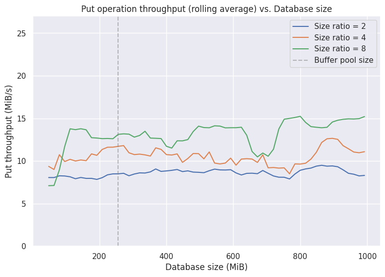
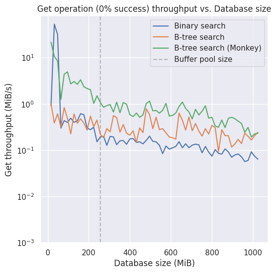
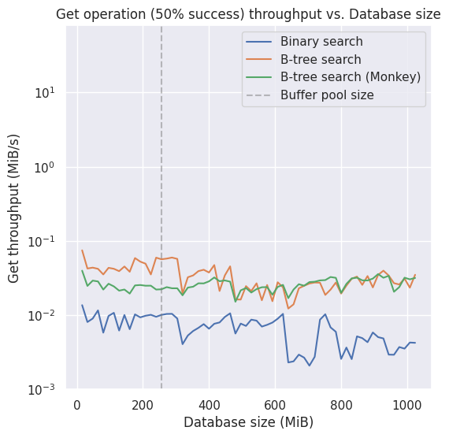
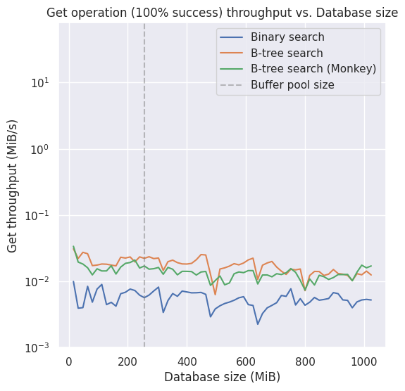
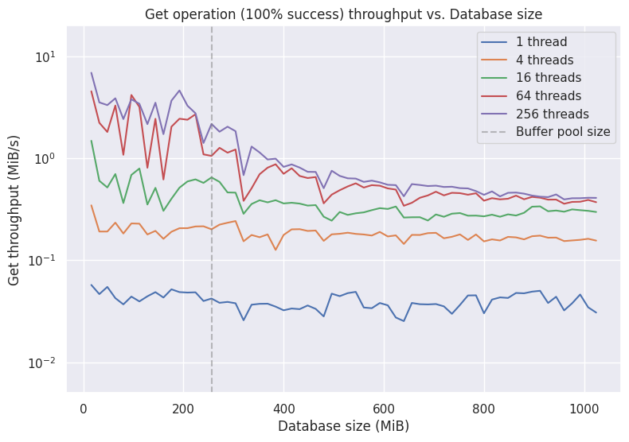
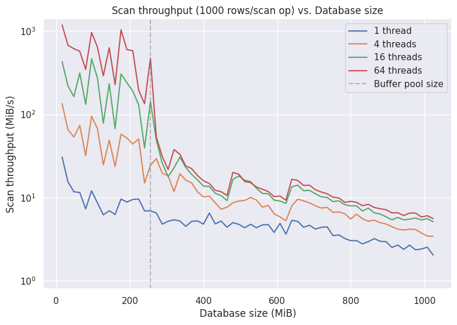
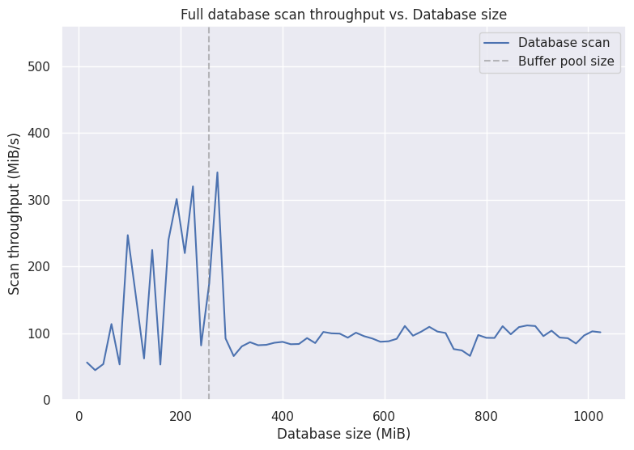

# BEARR - Better Efficient Alternative to RocksDB in Rust
<p align="center">
  
</p>

BEARR is a high-performance, multithread key-value engine written in Rust.

## Status

All core features are complete.

The following bonus features have also been implemented:
- Handling sequential flooding (with 2Q algorithm)
- Dostoevsky
- Using a min-heap for Dostoevsky
- Monkey

We also have the following additional features:
- Support for concurrent gets and scans from several threads
- Write Ahead Logging

The public interface is fully tested, including an integration test that performs a large number of random database operations, comparing against a HashMap oracle.

Most internal interfaces also have dedicated unit tests.

We have a set of 25 benchmarks that are used to measure and compare database throughput as we vary our configuration parameters.

## How to run

### Tests
You can view the latest test results in GitHub Actions via our workflow and the time each test takes, plus the maximum memory usage of all tests. 
#### Docker 
To run across all platforms, you can use **docker** to run the project. 
```bash
git clone https://github.com/aricasas/BEARR.git
cd BEARR 
docker build -f bearr-test .
docker run bearr-test
```

### In Rust

If you have [Rust and Cargo installed](https://rust-lang.org/tools/install/), you can use Cargo to run tests and experiments.

The basic command is `cargo test` to run all tests in debug mode. To run in release mode, use the `--release` flag. To run while capturing `println` output, provide `-- --nocapture` to the command. To run a specific test or set of tests, provide the name as an argument.

There are three conditional compilation options in the form of Cargo features:
- `binary_search`: use binary search instead of B-tree search for SSTs.
- `uniform_bits`: assign the same number of bits per entry for each LSM level instead of using Monkey.
- `keep_test_files`: do not delete any test files created as a result of running tests.

As an example, to run all the tests in `database.rs` in release mode with `binary_search` and `keep_test_files` active, run the command:

```
cargo test --release database --features binary_search,keep_test_files
```

To run the `test_concurrency` test in `database.rs` with `uniform_bits` active and `println` output visible, run the command:

```
cargo test database::tests::test_concurrency --features uniform_bits -- --nocapture
```

### Experiments

Instructions for running experiments are in the "Experiments" section of the README.

## Interface

Our project is designed as a library. The main item of interest is the `Database` struct.

Note that this project is Linux-exclusive.

`Database::create(name, configuration)` - creates and returns a database at the given path with the given configuration. Configuration options (`DbConfiguration`) include:
- Options for the LSM tree (`LsmConfiguration`):
  - Size ratio
  - Memtable capacity
  - Number of bits for the bloom filter
- Buffer pool capacity
- Number of pages to buffer for file writes
- Number of pages to buffer for sequential file reads
- Number of operations to buffer for the write-ahead log

`Database::open(name)` - opens and returns an existing database located at the given path.

`database.get(key)` - Returns the value for the given key.

`database.put(key, value)` - inserts the given key-value pair into the database.

`database.delete(key)` - deletes the key-value pair with the given key from the database.

`database.scan(start..=end)` - returns an iterator of key-value pairs where the key is in the given range (start to end inclusive).

`database.flush()` - manually flushes the database, writing the memtable to an SST and writing LSM metadata to disk. The database automatically handles closing upon being dropped, but this function can optionally be called if you need to handle any errors arising from the closing process.

For more details on the interface, run `cargo doc --open`.

## Design

### Public interface

The KV-store APIs are implemented on the `Database` struct in `database.rs`.

Keys and values are of the `u64` type (64-bit unsigned integer). The tombstone value for deletions is represented as `u64::MAX`, and trying to insert this value into the database will return an error.

### LSM tree


LSM trees are implemented as the `LsmTree` struct in `lsm.rs`. They make use of Dostoevsky for compaction, and Monkey (optional, enabled by default) for assigning bloom filter bits.

#### Memtable

Our memtable is implemented as a Red-Black binary tree. The current implementation is the `MemTable<K, V>` struct in `memtable.rs`, which is generic over the types of keys and values. We only ever use it with the specific types of u64 for both keys and values, but we implemented it as generic in case we decided to change this in the future. The nodes in the tree store their keys, their values, their color, and pointers to their two children. We don't store pointers to the parents, and we use a non-recursive, top-down, one-pass algorithm for insertion and updates, which was inspired by [this source](https://web.archive.org/web/20190207151651/http://www.eternallyconfuzzled.com/tuts/datastructures/jsw_tut_rbtree.aspx). It also provides range scans via an iterator interface using a non-recursive algorithm.

The tree structure is stored in a contiguous vector of nodes, and we use indices into the vector as our pointers. This made the implementation process easier to write in safe Rust, and it allows us to very easily allocate the entire memory for the memtable up front and only once, when the database is opened.

#### Merging

Throughout our code, we use Rust iterators to handle sequences of key-value pairs to avoid the need to allocate and store all the data in memory. The memtable and the SSTs provide iterator interfaces, which we combine to perform compactions.

`MergedIterator` in `merge.rs` merges a list of such iterators into one large iterator, ensuring we preserve sorted order and that we only return the newest version of a given key-value pair. A min-heap is used in order to implement this merging iterator in an efficient way when there are more than two iterators being merged.

This merged iterator is also responsible for either preserving or erasing tombstone values as it reads them. When returning a scan iterator to the user, or when compacting at the last layer of the LSM tree, we pass in a flag to this merged iterator that makes it delete tombstone values from its output. 

### SST and B-tree

SSTs (Sorted String Tables) are immutable files that store key-value data on disk. Each SST consists of four main sections written in the following order:

**Metadata → Leafs → Nodes → Bloom Filter**

#### SST File Layout
```
┌─────────────────────────────────────────────────────────────┐
│ Page 0: METADATA                                            │
│  - Magic number, offsets, tree depth, sizes                 │
├─────────────────────────────────────────────────────────────┤
│ Pages 1..nodes_offset: LEAF NODES                           │
│  - Sorted key-value pairs (actual data)                     │
│  - Each leaf contains up to KEYS_PER_NODE pairs             │
├─────────────────────────────────────────────────────────────┤
│ Pages nodes_offset..bloom_offset: INTERNAL NODES            │
│  - Tree structure for navigation                            │
│  - Each node contains (largest_key, page offset) pairs      │
│  - Bottom internal nodes point to leaf pages offset         │
│  - Upper nodes point to lower internal nodes                │
├─────────────────────────────────────────────────────────────┤
│ Pages bloom_offset..end: BLOOM FILTER                       │
│  - Bitmap                                                   │
│  - Hash functions                                           │
└─────────────────────────────────────────────────────────────┘
```


---

#### Metadata
The metadata section stores critical information about the SST, including:
- Offsets for each section (leafs, nodes, bloom filter)
- Total SST size
- Bloom filter size and number of hash functions

---

#### Leafs
Leafs are sorted blocks of key-value pairs stored contiguously on disk in the format of Pages. They can be viewed as a persistent, sorted representation of the memtable. Each leaf contains up to 255 key-value pairs (approximately `PAGE_SIZE / (KEY_SIZE + VALUE_SIZE)` = `4096B / 16B` ≈ 255 entries per page).

---

#### Nodes (B+ Tree Index)
The nodes form a B+ tree index over the leafs, enabling efficient lookups. 

**Structure:**
- Each node can reference up to 255 children
- Internal nodes store the maximum key from each child
- The lowest level of nodes points directly to leaf pages
- Nodes are written contiguously to maintain good read/write locality

**Performance Analysis:**

For a 10GB database:
- **Tree depth:** $\log_{255}(\frac{10 \times 10^9}{16}) \approx 4$
- **Index size:** $\frac{10^{10}}{16 \times 255 \times 255} \times 4096 \approx 40\text{MB}$
- **Overhead:** 40MB / 10GB = **0.4%** (negligible)

**Lookup Performance:**
- **With B-tree:** `Tree Depth + 1` I/O accesses (~5 I/Os for 10GB)
- **Without B-tree (binary search):** $\log_2(\frac{\text{DataSize}}{16 \times 255})$ I/O accesses (~21 I/Os for 10GB)

The B-tree index provides approximately **5× faster lookups** compared to binary search. You can disable indexing and use binary search with the `--features binary_search` flag.

**Trade-off:** The B-tree requires sufficient memory to construct the index during SST creation but.

---

#### Bloom Filter
Each SST includes a Bloom filter to quickly determine if a key might exist in the file without reading the entire SST.

**Implementation:**
- Stored as a contiguous byte array after the nodes section
- Size and hash function count are configurable
- Optimizations like Monkey are applied for efficiency

---

#### SST Consistency Guarantees
SSTs maintain consistency through a write-ordering protocol:

**Write Order:** Leafs → Nodes → Bloom Filter → Metadata

The metadata contains a magic number that serves as a consistency check. If any error occurs during the write process, the magic number will be invalid, marking the SST as corrupt and preventing its use. This ensures that partially written SSTs are never treated as valid.

### File system and buffer pool

We have a `FileSystem` struct, implemented in `file_system.rs`, for working with data files. Page IDs -- data of the form (LSM level, SST number, page number) -- are translated into file names by the file system to access files.

The buffer pool, implemented as a hash table, is part of the file system. In order to share the file system in multiple places while simultaneously mutating the buffer pool, we have an inner file system behind a mutex.

Modifying a file invalidates its entries in the buffer pool. To help with this, we have a different page ID type for the buffer pool. Translating between the two ID types is done by the `FileMap` struct, which can disassociate a buffer pool page ID from a regular page ID when the entries in the buffer pool are invalidated.

#### Hashing and hash table

The hash table is implemented in `hashtable.rs` as the `HashTable` struct. It uses linear probing to resolve collisions.

For hash functions, we have a common `HashFunction` struct in `hash.rs` that is used in both the hash table and the bloom filter. It is initialized with a random seed upon creation. The hash algorithm used is MurmurHash.

#### Eviction policy

### Write-Ahead Logging (WAL)

The database implements a configurable write-ahead logging system to ensure durability and crash recovery. 
In our implementation, each write operation follows a buffered logging protocol. When a key-value pair is inserted into the database via a `put` operation, the entry is first appended to an in-memory log buffer. This buffer accumulates write operations until it reaches a configurable threshold size, at which point all buffered entries are synchronously flushed to the persistent log file on disk using an `fsync` operation to ensure durability. This batching strategy amortizes the cost of expensive disk synchronization operations across multiple writes, improving overall write throughput.

During database initialization or recovery, the system performs a sanity check operation by replaying the entire log file. This process reconstructs the in-memory state by applying all logged operations sequentially, ensuring that the database reflects all committed writes that were persisted to the log but may not have been flushed to the SST files before a crash. The redo mechanism is critical for maintaining consistency and preventing data loss across restart boundaries.

To prevent unbounded log file growth, the system implements a checkpointing mechanism. When the memtable is flushed to disk as an SST file, the corresponding entries in the log file become redundant since they are now durably stored in the persistent SST structure. At this point, the log file is truncated, removing all entries that have been successfully persisted to SSTs. This checkpointing process keeps the log file size manageable and reduces recovery time, as fewer log entries need to be replayed during startup.

The log buffer size is a tuning parameter that presents a fundamental tradeoff between robustness and performance. Smaller buffer sizes result in more frequent synchronous flushes to disk, which increases the I/O overhead and reduces write throughput. However, this configuration provides stronger durability guarantees since less data resides in volatile memory at any given time. Conversely, larger buffer sizes improve performance by reducing the frequency of expensive disk synchronization operations and allowing more effective batching of writes. The drawback is that more data may be lost if a crash occurs before the buffer is flushed, as all uncommitted entries in the buffer will be lost.

To quantify this tradeoff, we introduce a **Robustness Metric** defined as:

$$\text{Robustness Metric} = \frac{\text{Log Buffer Size}}{\text{Memtable Size}}$$

This metric represents the upper bound of the expected fraction of data loss relative to the total in-memory state in the event of a system crash. For example, a robustness metric of 0.1 indicates that at most, 10% of the memtable's data could be lost in a worst-case crash scenario where the log buffer has not yet been flushed. A lower metric indicates a more robust configuration with smaller potential data loss windows, while a higher metric suggests prioritization of performance over durability. You can tune this parameter based on your application's specific requirements.

** Disclaimer: As of now, because of the format of the WAL and since it's a text file, the performance is not good. But it works, and there are several tests simulating a database crash and showing how the recovery works. For future work, the text file can be converted to a binary file for optimized operations.


## Experiments

We designed several experiments to measure the throughput of our get, put, and scan operations. Unless otherwise specified, these were run on the teach.cs server with the following parameters:

- Memtable capacity: 10 MiB
- Buffer pool capacity: 256 MiB
- Bloom filter bits per entry at L1 (using Monkey): 13 bits
- LSM tree size ratio: 4
- Compaction write buffering: 96 pages
- Sequential readahead buffering: 128 pages
- Write-ahead log: disabled
- Final database size: 1 GiB
- One sample every 16 MiB of data inserted

We picked the memtable capacity to match what was requested. We picked 256 MiB as the buffer pool capacity to be able to see the difference in our throughputs as the database grows too big to fit in the buffer pool. Our database uses Monkey by default to allocate memory to bloom filters, and we calculated that the total memory used in a 1 GiB database with 8 bits per entry is 512 MiB. To match this total amount of memory, we use 13 bits per entry at the highest LSM tree level, and with Monkey, this will end up using a similar amount of total memory. We calculated this in `bloom_bits.py`. We use a size ratio of 4, as we saw this gives us a good balance between read and write throughputs. We chose 96 pages for read buffering and 128 pages for write buffering after a little testing on the teach.cs server showed they provided reasonable performance. We disable the write-ahead logging feature since its performance is really slow for now.


To run all the experiments and get the CSV data output used to generate the figures, use:
```sh
$ ./run_experiments.sh
```

This will run 25 benchmarks that build a 1 GiB database each and take a sample of the throughput every 16 MiB. The shortest takes around 2.5 min and the longest around 25 min. In total, they took [TODO] on the teach.cs server. Note that the units used in the output files are in terms of key-value pairs and not MiB like the graphs. 

To run a specific benchmark, we can use:
```sh
$ cargo build --release
$ ./target/release/experiments --<benchmark_name> out.csv [OPTIONS]
```

To help see the configuration options available and possible benchmarks, use:
```sh
$ cargo build --release
$ ./target/release/experiments --help
```

And there are plenty of example usages in the `run_experiments.sh` file.

All the experiments insert unique uniformly random keys and values, and queries are also uniformly randomly distributed.

### LSM tree size ratio


[TODO] other image of get throughput

In this experiment, we compare the put and get operations throughput as we vary the size ratio of the LSM tree. The data we get from the put operation throughput is really chaotic because compactions happen in some samples but not in others. To make the data easier to interpret and contrast, we calculated a running average of 5 samples, and this is what is displayed on the graph. The data from the get operations was left as is.

As we increase the size ratio of the LSM tree, we expect the put throughput to increase and the get throughput to decrease, which indeed happens. This shows that our database can be tuned to prioritize put operation throughput if the workload is write-heavy or get operation throughput if the workload is read-heavy.

### Binary search vs. B-tree search







In this experiment, we compare the throughput of the get operation when using binary search vs. B-tree search when doing a point query to an SST. We also compare how enabling Monkey affects the get throughput. This is the only experiment where we disable Monkey on the database. We also test the performance of get operations where 0% are to keys that exist in the database, or 50% are to keys that exist, or 100% are to keys that exist. 

At 0% success for get operations, using Monkey is noticeably faster since this test relies more on avoiding I/O from false positive filter queries. Binary search is last, but the difference isn't as big as in the other graphs. This is because there are fewer point queries to the SSTs, as it can skip them using the filters, so the binary search doesn't slow it down as much.

At 50% and 100% success for get operations, binary search is a lot slower than B-tree search. And everything is slower than at 0% success. In here, most get operations will result in I/O, so the binary search algorithm is a lot slower. As we can see from the spiky structure of the graphs, the throughput on gets is affected by how many and how big the SSTs are, but overall remains approximately constant as the database size grows.

### Concurrency






In this experiment, we measure the throughput of concurrent reads from multiple threads. As we increase the number of threads, we can perform many concurrent file reads to the SSTs. Since this experiment is running on the teach.cs server, which uses SSDs for storage, we expect the throughput to increase. This is because SSDs can perform I/Os in parallel. However, there seems to be a point of diminishing returns, where adding more threads cannot increase throughput past this. 

### Full database scan



In this experiment, we measure the throughput of doing a full database scan as the database grows. Before the database grows to 256 MiB, the whole database can fit in the buffer pool, so the throughput has really high peaks when it has cached the SSTs and reads from memory. After 256 MiB, the throughput settles at ~140 MiB/sec. [TODO] change this number if new run changes


## Contributing

We welcome contributions to BEARR! Whether you're fixing bugs, adding features, improving documentation, or sharing ideas, your help is appreciated.

### How You Can Contribute

- **Code contributions**: Implement new features, optimize performance, or fix bugs
- **Documentation**: Improve explanations, add examples, or fix typos
- **Testing**: Write additional tests or report issues you discover
- **Ideas**: Suggest new features or improvements through GitHub Issues
- **Experiments**: Run benchmarks and share your results

### Getting Started

1. Fork the repository
2. Create a new branch for your feature (`git checkout -b feature/amazing-feature`)
3. Make your changes and ensure tests pass (`cargo test`)
4. Commit your changes (`git commit -m 'Add amazing feature'`)
5. Push to your branch (`git push origin feature/amazing-feature`)
6. Open a Pull Request

### Development Guidelines

- Follow Rust's standard formatting (use `cargo fmt`)
- Run `cargo clippy` to catch common issues
- Add tests for new functionality
- Update documentation as needed
- Keep commits focused and write clear commit messages

### Questions or Need Help?

Feel free to open an issue if you have questions or need guidance. We're happy to help new contributors get started!

---

We'd love to grow this project with your help. Every contribution, no matter how small, makes a difference! 🐻

## Todos
- Async Writes with io_uring
- Binary writes to the WAL
- Partial compactions
